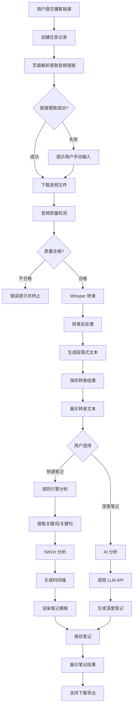

# 播客分析软件开发计划

## 文档管理
- **文档版本**: 2.9
- **创建日期**: 2026-02-24
- **最后更新**: 2026-02-24 16:30
- **维护者**: Claude Code
- **变更记录**:
  - v2.9 (2026-02-24 16:30): 开始Phase 4讲话人识别功能-使用pyannote.audio,支持可选启用和自定义讲话人名称
  - v2.8 (2026-02-24 16:00): 优化笔记生成功能-简化规则引擎输出,优化AI提示词(详细描述+金句分享)
  - v2.7 (2026-02-24 15:45): 添加Web界面增强需求(文件预览/下载、播客管理、播客命名),开始实现Phase 3.5增强功能
  - v2.6 (2026-02-24 15:30): 完成Web端功能全面测试,所有核心功能测试通过,修复run_web.py导入路径问题
  - v2.5 (2026-02-24 15:12): 完成Phase 3 Web界面开发,实现Flask后端API和前端页面
  - v2.4 (2026-02-24 15:05): 添加豆包和通义千问AI笔记生成支持,测试通义千问API成功
  - v2.3 (2026-02-24 15:00): 完成Phase 2笔记生成功能开发,实现规则引擎和AI笔记生成器
  - v2.2 (2026-02-24 14:50): 完成转录格式变更,测试通过,确认Markdown和PDF输出正常
  - v2.1 (2026-02-24 14:30): 移除JSON格式转录输出,改为直接生成Markdown和PDF格式
  - v2.0 (2026-02-24): 完成系统架构设计，明确技术栈和实现细节

## 变更管理流程
**重要**: 所有对本文档和代码的修改必须遵循以下流程：
1. **变更提议**: 任何功能、设计或需求的变更必须先提出
2. **变更讨论**: 开发者与用户共同讨论变更的必要性和影响
3. **文档更新**: 先在本文档中更新相关部分，记录变更原因和细节
4. **代码实现**: 在文档更新并获得确认后，再进行代码修改
5. **回环检查**: 每次修改完成后，开发者必须：
   - 告知用户具体修改内容
   - 说明修改原因
   - 验证修改的正确性
   - 更新相关文档

## 依赖管理流程
**重要**: 所有Python依赖包的安装和更新必须遵循以下规范，确保项目可复现性：

### 依赖安装规范
- **新依赖添加**: 在安装任何新Python包之前，必须先在requirements.txt中添加相应条目
- **版本管理**: 使用明确的版本号或版本范围
- **注释说明**: 对于特殊安装要求，添加注释说明（如CPU版本、特定索引源）
- **环境说明**: 区分生产依赖、开发依赖、可选依赖

## 项目概述

### 项目名称
播客分析软件/网站

### 项目目标
开发一款能够自动转录播客音频/视频，输出中文全文，总结作者观点和言论，并进行深度分析的软件。

### 核心价值
- 自动化处理播客内容，节省人工转录时间
- 提取关键信息，辅助内容理解和分析
- 生成结构化报告，便于知识管理和分享

### 目标用户
个人用户，用于分析收藏的小宇宙播客内容

### 当前状态
- ✅ Phase 1: 音频下载 + 转录（已完成，已测试）
- ✅ Phase 2: 笔记生成（已完成，已测试）
- ✅ Phase 3: Web 界面（基础版已完成，已全面测试）
- 🔄 Phase 4: 优化与扩展（待开发）

## 需求规格

### 功能需求
1. **音频获取功能**
   - 支持从小宇宙播客平台获取音频文件
   - 提供多种获取方式：页面URL解析、手动链接输入、文件上传
   - 可靠下载音频文件到本地

2. **语音转文本功能**
   - 将音频准确转录为中文文本
   - 支持时间戳标注
   - 支持中英文混合内容识别
   - **输出格式**: 直接生成Markdown和PDF格式,不生成JSON中间文件
   - **文本切分**: 按语义句子切分,每句一行,使用bullet point格式

3. **文本分析功能**
   - 文本清洗和格式化
   - 关键观点提取
   - 章节摘要生成
   - 基础的情感分析和话题识别

4. **报告生成功能**
   - 生成结构化分析报告
   - 支持多种输出格式（文本、Markdown、PDF）
   - 可视化图表展示

5. **笔记生成功能**
   - 自动将分析内容生成结构化笔记存储
   - 支持与用户交互产生观点碰撞后的总结和笔记存储
   - 提供可配置的笔记模板系统
   - 支持笔记的组织、检索和导出功能
   - 笔记格式支持Markdown、HTML等常用格式

### 非功能需求
1. **性能要求**
   - 音频下载：支持大文件断点续传
   - 语音识别：可接受小时级处理时间
   - 系统响应：用户操作响应时间<3秒

2. **可靠性要求**
   - 音频获取成功率>90%
   - 系统稳定性：支持7×24小时运行
   - 错误处理：完善的异常处理和恢复机制

3. **可用性要求**
   - 界面简洁直观
   - 操作流程清晰
   - 提供详细的使用说明

### 约束条件
1. **技术约束**
   - 目标平台：小宇宙播客
   - 主要语言：中文
   - 部署环境：个人使用，支持本地部署
2. **业务约束**
   - 个人使用场景
   - 无商业化计划
   - 尊重版权，仅分析个人收藏内容

### 详细需求澄清

1. **核心交互流程**:
   - 用户提交播客链接 → 音频下载 → 语音转录 → 转录文本展示 → 笔记生成
   - 转录文本采用段落式格式，包含时间戳范围
   - 笔记生成提供两种模式：规则引擎（快速）和 AI 分析（深度）

2. **大模型集成方案**:
   - **模式A（规则引擎）**: 基于 NLP 算法的自动分析（免费，本地运行）
     - 关键词提取、关键句识别
     - 5W1H 分析（基于关键词匹配和句式分析）
     - 时间轴生成、金句摘录
   - **模式B（AI 分析）**: 调用大模型 API 进行深度总结
     - 主推 DeepSeek API
     - 扩展支持 Claude API、OpenAI API
     - 用户在设置中配置 API Key

3. **全文转录功能要求**:
   - **Phase 1**: 不做讲话人分离，统一标注时间戳
   - **Phase 2**: 可选集成 pyannote.audio 进行讲话人识别
   - 转录格式：段落式，合并短句，标注时间范围
   - 支持在线浏览和下载（.txt, .md, .json 格式）
   - 下载后可本地编辑，不提供在线编辑功能

4. **硬件环境约束**:
   - 开发环境：AMD 核显，无 GPU 加速
   - 语音识别：使用 faster-whisper medium 模型（CPU 优化）
   - 预期性能：1 小时音频约需 10-20 分钟转录

## 系统架构

### 技术栈选型

**后端技术**:
- **Web 框架**: Flask 2.3+
- **异步任务**: Celery 5.3+ + Redis 7.0+
- **数据库**: SQLite 3（元数据存储）
- **语音识别**: faster-whisper 0.10+（medium 模型）
- **NLP 处理**: jieba 0.42+（分词）、scikit-learn（TextRank）
- **HTTP 请求**: requests 2.31+、BeautifulSoup4 4.12+

**前端技术**:
- **基础**: HTML5 + CSS3 + JavaScript (ES6+)
- **样式框架**: Bootstrap 5.3（可选）
- **异步请求**: Fetch API / Axios

**AI 集成**:
- **主推**: DeepSeek API
- **扩展**: Claude API、OpenAI API
- **SDK**: 使用官方 Python SDK 或 requests 封装

**开发环境**:
- Python 3.11
- 操作系统：Windows 10
- 硬件：AMD 核显（无 GPU 加速）

### 核心模块设计

1. **音频获取模块** (`src/audio_fetcher.py`)
   - 页面解析器：BeautifulSoup 解析小宇宙页面
   - 音频链接提取：正则表达式匹配 .m4a 链接
   - 下载管理器：requests 流式下载、进度显示（tqdm）
   - 音频验证器：检测文件完整性和格式

2. **语音识别模块** (`src/transcriber.py`)
   - Whisper 集成器：faster-whisper medium 模型
   - 音频质量检测：librosa 检测采样率、时长、静音
   - 转录重试机制：最多 3 次重试，指数退避
   - 后处理器：文本清理、时间戳对齐、段落合并

3. **文本分析模块** (`src/analyzer.py`)
   - **规则引擎**:
     - 分词处理：jieba 分词 + 停用词过滤
     - 关键词提取：TF-IDF 算法
     - 关键句提取：TextRank 算法
     - 5W1H 分析：关键词匹配 + 句式分析
     - 金句摘录：句子长度 + 关键词密度打分
   - **AI 分析器**:
     - LLM 客户端封装（DeepSeek/Claude/OpenAI）
     - Prompt 模板管理
     - API 调用重试和错误处理

4. **笔记生成模块** (`src/note_generator.py`)
   - 规则引擎笔记生成器：基于分析结果渲染模板
   - AI 笔记生成器：调用 LLM API 生成深度笔记
   - 模板引擎：Jinja2 渲染 Markdown 模板
   - 导出器：支持 .md、.txt、.json 格式

5. **Web 界面模块** (`src/web/`)
   - **后端 API** (`app.py`):
     - RESTful 接口设计
     - 任务提交、状态查询、结果获取
     - 文件上传和下载
   - **前端页面** (`templates/`, `static/`):
     - 首页：任务提交表单
     - 任务列表：实时状态展示
     - 详情页：转录文本和笔记展示
     - 设置页：API Key 配置

6. **任务管理模块** (`src/task_manager.py`)
   - Celery 任务定义：下载、转录、分析任务
   - 任务队列管理：优先级、重试策略
   - 进度追踪：实时更新任务状态
   - 错误处理：异常捕获、日志记录

7. **数据存储模块** (`src/database.py`)
   - SQLite 数据库操作封装
   - 表结构：podcasts、transcripts、notes、tasks
   - 文件系统管理：音频、转录、笔记文件组织

### 数据处理流程



### 数据存储方案

**目录结构**:
```
podcast-analyzer/
├── src/                    # 源代码
│   ├── audio_fetcher.py
│   ├── transcriber.py
│   ├── analyzer.py
│   ├── note_generator.py
│   ├── task_manager.py
│   ├── database.py
│   └── web/
│       ├── app.py
│       ├── templates/
│       └── static/
├── data/                   # 数据存储
│   ├── audio/              # 原始音频文件
│   │   └── {podcast_id}.m4a
│   ├── transcripts/        # 转录文本
│   │   ├── {podcast_id}.md     # Markdown格式
│   │   └── {podcast_id}.pdf    # PDF格式
│   ├── notes/              # 生成的笔记
│   │   ├── {podcast_id}_auto.md    # 规则引擎笔记
│   │   └── {podcast_id}_ai.md      # AI 笔记
│   └── database.db         # SQLite 数据库
├── models/                 # Whisper 模型文件
├── config/                 # 配置文件
│   ├── config.yaml
│   └── prompts.yaml        # AI Prompt 模板
├── logs/                   # 日志文件
├── requirements.txt
└── README.md
```

**数据库表设计**:

```sql
-- 播客记录表
CREATE TABLE podcasts (
    id TEXT PRIMARY KEY,              -- UUID
    title TEXT NOT NULL,              -- 播客标题
    url TEXT NOT NULL,                -- 原始页面 URL
    audio_url TEXT,                   -- 音频下载链接
    duration INTEGER,                 -- 时长（秒）
    file_size INTEGER,                -- 文件大小（字节）
    created_at TIMESTAMP DEFAULT CURRENT_TIMESTAMP,
    status TEXT NOT NULL,             -- pending/downloading/transcribing/completed/failed
    error_message TEXT                -- 错误信息
);

-- 转录记录表
CREATE TABLE transcripts (
    id INTEGER PRIMARY KEY AUTOINCREMENT,
    podcast_id TEXT NOT NULL,
    file_path TEXT NOT NULL,          -- 转录文件路径
    word_count INTEGER,               -- 字数统计
    model_version TEXT,               -- Whisper 模型版本
    created_at TIMESTAMP DEFAULT CURRENT_TIMESTAMP,
    FOREIGN KEY (podcast_id) REFERENCES podcasts(id)
);

-- 笔记记录表
CREATE TABLE notes (
    id INTEGER PRIMARY KEY AUTOINCREMENT,
    podcast_id TEXT NOT NULL,
    note_type TEXT NOT NULL,          -- auto（规则引擎）/ ai（大模型）
    file_path TEXT NOT NULL,          -- 笔记文件路径
    model_name TEXT,                  -- AI 模型名称（如 deepseek-chat）
    created_at TIMESTAMP DEFAULT CURRENT_TIMESTAMP,
    FOREIGN KEY (podcast_id) REFERENCES podcasts(id)
);

-- 任务队列表
CREATE TABLE tasks (
    id TEXT PRIMARY KEY,              -- Celery Task ID
    podcast_id TEXT NOT NULL,
    task_type TEXT NOT NULL,          -- download/transcribe/analyze
    status TEXT NOT NULL,             -- pending/running/completed/failed
    progress INTEGER DEFAULT 0,       -- 进度百分比
    created_at TIMESTAMP DEFAULT CURRENT_TIMESTAMP,
    updated_at TIMESTAMP DEFAULT CURRENT_TIMESTAMP,
    FOREIGN KEY (podcast_id) REFERENCES podcasts(id)
);

-- 系统配置表
CREATE TABLE settings (
    key TEXT PRIMARY KEY,
    value TEXT NOT NULL,
    updated_at TIMESTAMP DEFAULT CURRENT_TIMESTAMP
);
```

**转录文本格式**:
转录结果直接保存为Markdown格式,不再生成JSON中间文件。

Markdown格式示例:
```markdown
# 播客转录

**播客 ID**: uuid-string

**转录模型**: qwen-paraformer-v2

---

## 段落 1 [00:00:00 - 00:00:15]

- 大家好，欢迎收听本期播客。
- 今天我们要讨论的话题是人工智能的发展趋势。

## 段落 2 [00:00:15 - 00:00:32]

- 人工智能技术在过去几年取得了突破性进展。
- 特别是在自然语言处理领域。
```

PDF格式包含相同内容,使用中文字体(微软雅黑)渲染。

## 技术实现细节

### 音频获取实现
基于用户提供的小宇宙音频获取方法：
1. **页面解析策略**:
   ```python
   # 方法1: 搜索音频标签
   audio_tags = soup.find_all(['audio', 'source'])
   
   # 方法2: 正则表达式匹配音频链接
   audio_pattern = r'https?://[^"\'\s]+\.m4a[^"\'\s]*'
   
   # 方法3: 搜索包含audio关键字的链接
   all_links = soup.find_all('a', href=True)
   ```

2. **下载管理**:
   - 使用`requests`库进行流式下载
   - 实现进度条显示 (`tqdm`)
   - 支持大文件分块下载
   - 异常处理和重试机制

3. **反爬策略**:
   - 设置合理的User-Agent
   - 添加请求间隔
   - 模拟浏览器行为

### 全文转录功能设计
基于用户要求，全文中文转录需要满足以下需求：
1. **Phase 1**: 不做讲话人分离，统一标注时间戳
2. **可阅读格式**: 段落式展示，合并短句
3. **可下载格式**: 支持 .txt、.md、.json 格式导出
4. **时间戳信息**: 每个段落标注时间范围 [开始-结束]

## 开发计划

### Phase 1: 核心功能（音频下载 + 转录）- ✅ 已完成
**目标**: 实现基础的音频获取和转录功能

**完成状态**: ✅ 已完成 (2026-02-24)

**已实现功能**:
1. ✅ 项目初始化
   - 创建目录结构
   - 配置 requirements.txt
   - 初始化数据库表结构

2. ✅ 音频获取模块
   - 实现小宇宙页面解析
   - 实现音频下载功能(支持文件缓存)
   - 实现音频质量检测

3. ✅ 语音识别模块
   - 集成通义千问 API (paraformer-v2模型)
   - 实现转录功能
   - 实现转录后处理（句子级切分）

4. ✅ 转录格式化模块
   - 实现Markdown格式输出(句子级bullet point)
   - 实现PDF格式输出(中文字体支持)
   - 移除JSON中间格式

5. ✅ 数据存储模块
   - 实现 SQLite 数据库操作
   - 实现文件系统管理

6. ✅ 测试验证
   - 测试音频下载和缓存
   - 测试转录准确度
   - 测试Markdown和PDF生成
   - 测试错误处理

**交付成果**:
- ✅ 可运行的命令行工具
- ✅ 能够下载并转录小宇宙播客
- ✅ 生成易读的Markdown和PDF格式转录文本

### Phase 2: 笔记生成（规则引擎 + AI）- ✅ 已完成
**目标**: 实现两种笔记生成模式

**完成状态**: ✅ 已完成 (2026-02-24)

**已实现功能**:
1. ✅ 文本分析模块 (src/analyzer.py)
   - 实现关键词提取（基于 TF-IDF）
   - 实现关键句提取（基于 TextRank）
   - 实现 5W1H 分析（基于关键词匹配和句式分析）
   - 实现金句摘录（基于句子长度和关键词密度）
   - 实现时间轴生成

2. ✅ 笔记生成模块 (src/note_generator.py)
   - 实现规则引擎笔记生成
   - 使用 Jinja2 模板渲染
   - 支持 Markdown 格式输出
   - 包含关键词、核心观点、金句、5W1H、时间轴等结构化内容

3. ✅ AI 笔记生成模块 (src/ai_note_generator.py)
   - 封装 DeepSeek API 客户端（使用 OpenAI SDK）
   - 支持 Claude、OpenAI、豆包、通义千问 API 扩展
   - 实现 Prompt 模板管理
   - 实现重试机制和错误处理
   - 测试通义千问 API 成功，生成高质量笔记

4. ✅ 配置文件更新
   - 在 config.yaml 中添加 AI 配置项
   - 支持多个 AI 提供商配置：DeepSeek、Claude、OpenAI、豆包、通义千问

5. ✅ 测试验证
   - 创建测试脚本 test_note_generation.py
   - 测试规则引擎笔记生成成功
   - 生成的笔记包含完整的结构化内容
   - 创建测试脚本 test_qwen_ai_note.py
   - 测试通义千问 AI 笔记生成成功
   - 生成的 AI 笔记质量高，内容结构清晰、分析深入

**交付成果**:
- ✅ 完整的文本分析功能
- ✅ 规则引擎笔记生成功能
- ✅ AI 笔记生成框架（支持 DeepSeek、Claude、OpenAI、豆包、通义千问）
- ✅ 测试脚本和示例输出
- ✅ 通义千问 API 测试通过，生成高质量 AI 笔记

### Phase 3: Web 界面 - ✅ 已完成（基础版）
**目标**: 提供友好的 Web 操作界面

**完成状态**: ✅ 基础功能已完成 (2026-02-24)

**已实现功能**:
1. ✅ 后端 API (src/web/app.py)
   - 实现 Flask 应用框架
   - 设计 RESTful API 接口
   - 播客列表查询 API
   - 播客详情查询 API
   - 播客任务创建 API（同步处理）
   - 笔记生成 API（支持规则引擎和 AI 两种模式）
   - 文件下载 API
   - 设置查询 API

2. ✅ 前端页面 (src/web/templates/, src/web/static/)
   - 首页：任务提交表单
   - 播客列表：实时状态展示
   - 详情模态框：转录和笔记展示
   - 笔记生成按钮：支持规则引擎、通义千问���DeepSeek
   - 响应式设计：支持移动端

3. ✅ 数据库扩展
   - 添加 get_all_podcasts() 方法
   - 添加 get_transcripts_by_podcast() 方法
   - 添加 get_notes_by_podcast() 方法

4. ✅ 测试验证（2026-02-24 15:30 全面测试完成）
   - Flask 应用成功启动在 http://127.0.0.1:5000
   - 配置文件路径修复
   - 数据库连接正常
   - **修复问题**: run_web.py 导入路径错误已修复
   - **API 测试**: 所有 API 接口测试通过
     - ✅ GET /api/podcasts - 播客列表查询
     - ✅ GET /api/podcasts/{id} - 播客详情查询
     - ✅ POST /api/notes/generate - 笔记生成（规则引擎）
     - ✅ POST /api/notes/generate - 笔记生成（通义千问 AI）
     - ✅ GET /api/settings - 设置查询
   - **前端测试**: 页面和静态资源加载正常
     - ✅ 首页正常加载
     - ✅ JavaScript 文件加载正常
     - ✅ CSS 文件加载正常
     - ✅ Bootstrap CDN 正常
   - **功能测试**: 核心功能全部正常
     - ✅ 规则引擎笔记生成成功（关键词、核心观点、金句、5W1H、时间轴）
     - ✅ AI 笔记生成成功（通义千问，高质量深度分析）
     - ✅ 笔记文件保存正常
     - ✅ 数据库记录创建正常
   - **详细测试报告**: 见 WEB_TEST_REPORT.md

**交付成果**:
- ✅ 完整的 Web 应用框架
- ✅ RESTful API 接口（全部测试通过）
- ✅ 友好的用户界面
- ✅ 实时状态展示
- ✅ 规则引擎笔记生成功能（已测试）
- ✅ AI 笔记生成功能（通义千问已测试）
- ✅ 完整的测试报告（WEB_TEST_REPORT.md）

**待优化项**（Phase 3.5 - 进行中）:
- 🔄 修复文件下载功能
- 🔄 添加文件在线预览功能
- 🔄 添加播客管理功能（删除、批量删除、清空）
- 🔄 添加播客命名功能
- 🔄 实现文件命名与播客名称同步

**待优化项**（Phase 4）:
- 集成 Celery 异步任务队列
- 实现任务进度追踪
- 添加状态轮询机制
- 优化并发处理

### Phase 3.5: Web 界面增强 - 🔄 进行中
**目标**: 完善 Web 界面的用户体验和管理功能

**完成状态**: 🔄 开发中 (2026-02-24)

**需求背景**:
用户在使用 Phase 3 基础版 Web 界面后，提出了三个重要的功能需求：
1. 文件下载功能存在问题，需要修复并添加预览功能
2. 缺少播客管理功能，无法删除或清空已上传的播客
3. 播客命名不友好，需要支持自定义命名并同步到文件名

**功能需求**:

1. **文件预览和下载功能**
   - **问题��析**: 当前 `/api/files/<path:file_path>` 接口存在路径处理问题
   - **修复下载**:
     - 修正文件路径解析逻辑
     - 支持相对路径和绝对路径
     - 添加文件存在性检查
     - 设置正确的 Content-Type 和文件名
   - **添加预览**:
     - 新增 `/api/files/preview/<path:file_path>` 接口
     - 支持 Markdown 文件在线预览（转换为 HTML）
     - 支持文本文件直接预览
     - 前端添加预览模态框
   - **前端优化**:
     - 添加"预览"和"下载"两个按钮
     - 预览按钮打开模态框显示内容
     - 下载按钮触发文件下载

2. **播客管理功能**
   - **删除单个播客**:
     - 新增 `DELETE /api/podcasts/<podcast_id>` 接口
     - 删除播客记录、转录记录、笔记记录
     - 删除关联的音频文件、转录文件、笔记文件
     - 前端添加"删除"按钮（带确认对话框）
   - **批量删除播客**:
     - 新增 `POST /api/podcasts/batch-delete` 接口
     - 支持传入多个 podcast_id
     - 前端添加复选框和"批量删除"按钮
   - **清空所有播客**:
     - 新增 `DELETE /api/podcasts/clear-all` 接口
     - 清空所有播客记录和文件
     - 前端添加"清空全部"按钮（带二次确认）
   - **数据库扩展**:
     - 添加 `delete_podcast(podcast_id)` 方法
     - 添加 `delete_podcasts_batch(podcast_ids)` 方法
     - 添加 `clear_all_podcasts()` 方法

3. **播客命名功能**
   - **自定义命名**:
     - 在播客详情页添加"重命名"功能
     - 新增 `PUT /api/podcasts/<podcast_id>/rename` 接口
     - 更新数据库中的 title 字段
   - **文件命名同步**:
     - 修改转录文件命名逻辑：`{title}.md` 和 `{title}.pdf`
     - 修改笔记文件命名逻辑：`{title}_auto.md` 和 `{title}_ai.md`
     - 重命名时自动重命名关联文件
   - **命名规则**:
     - 支持中文、英文、数字、下划线、连字符
     - 自动过滤非法文件名字符（`/\:*?"<>|`）
     - 限制长度（最多 100 字符）
   - **默认命名**:
     - 新建播客时尝试从页面提取标题
     - 提取失败则使用"未命名播客_{timestamp}"

**技术实现**:

1. **后端 API 扩展** (src/web/app.py)
   ```python
   # 文件预览接口
   @app.route('/api/files/preview/<path:file_path>', methods=['GET'])

   # 文件下载接口（修复）
   @app.route('/api/files/download/<path:file_path>', methods=['GET'])

   # 删除播客接口
   @app.route('/api/podcasts/<podcast_id>', methods=['DELETE'])

   # 批量删除接口
   @app.route('/api/podcasts/batch-delete', methods=['POST'])

   # 清空全部接口
   @app.route('/api/podcasts/clear-all', methods=['DELETE'])

   # 重命名接口
   @app.route('/api/podcasts/<podcast_id>/rename', methods=['PUT'])
   ```

2. **数据库方法扩展** (src/database.py)
   ```python
   def delete_podcast(self, podcast_id: str) -> bool
   def delete_podcasts_batch(self, podcast_ids: List[str]) -> int
   def clear_all_podcasts(self) -> int
   ```

3. **文件命名工具** (src/utils/file_naming.py - 新建)
   ```python
   def sanitize_filename(name: str) -> str
   def rename_podcast_files(old_name: str, new_name: str, podcast_id: str)
   ```

4. **前端功能扩展**
   - 添加预览模态框组件
   - 添加删除确认对话框
   - 添加重命名输入框
   - 添加批量操作复选框
   - 优化按钮布局和交互

**预期交付**:
- ✅ 文件下载功能正常工作
- ✅ 文件预览功能（Markdown 和文本）
- ✅ 播客删除功能（单个、批量、清空）
- ✅ 播客重命名功能
- ✅ 文件命名与播客名称同步
- ✅ 友好的用户交互体验

**测试计划**:
1. 测试文件下载和预览功能
2. 测试播客删除功能（单个、批量、清空）
3. 测试播客重命名功能
4. 测试文件命名同步
5. 测试边界情况（特殊字符、长文件名等）


### Phase 4: 优化与扩展 - 🔄 进行中

**目标**: 性能优化和功能扩展

**当前状态**: 🔄 进行中 - 讲话人识别功能开发

#### 4.1 讲话人识别功能 - 🔄 进行中

**需求描述**:
- 在转录过程中识别不同的讲话人
- 在转录文本中标注每句话的讲话人
- 支持用户自定义讲话人名称
- 作为可选功能，用户可以选择是否启用

**技术方案**:
- 使用 pyannote.audio 进行讲话人分离（Speaker Diarization）
- 需要 HuggingFace token 访问预训练模型
- 模型大小约 1GB，首次使用需要下载

**功能设计**:

1. **讲话人分离模块** (src/diarization.py - 新建)
   ```python
   class SpeakerDiarizer:
       """讲话人分离器"""

       def __init__(self, config: dict):
           """初始化，加载 pyannote.audio 模型"""

       def diarize(self, audio_path: str) -> List[Dict]:
           """
           对音频进行讲话人分离

           Returns:
               [
                   {"start": 0.0, "end": 5.2, "speaker": "SPEAKER_00"},
                   {"start": 5.2, "end": 10.5, "speaker": "SPEAKER_01"},
                   ...
               ]
           """

       def merge_with_transcript(self, transcript: List[Dict],
                                diarization: List[Dict]) -> List[Dict]:
           """
           将讲话人信息合并到转录结果中

           Returns:
               [
                   {"start": 0.0, "end": 5.2, "text": "...", "speaker": "SPEAKER_00"},
                   ...
               ]
           """
   ```

2. **讲话人管理模块** (src/speaker_manager.py - 新建)
   ```python
   class SpeakerManager:
       """讲话人管理器"""

       def __init__(self, db):
           """初始化"""

       def save_speakers(self, podcast_id: str, speakers: List[str]):
           """保存播客的讲话人列表"""

       def update_speaker_name(self, podcast_id: str,
                              speaker_id: str, name: str):
           """更新讲话人名称"""

       def get_speakers(self, podcast_id: str) -> Dict[str, str]:
           """获取播客的讲话人映射 {speaker_id: name}"""
   ```

3. **数据库扩展**
   - 新增 `speakers` 表：
     ```sql
     CREATE TABLE speakers (
         id INTEGER PRIMARY KEY AUTOINCREMENT,
         podcast_id TEXT NOT NULL,
         speaker_id TEXT NOT NULL,  -- SPEAKER_00, SPEAKER_01, etc.
         speaker_name TEXT,          -- 用户自定义名称
         created_at TIMESTAMP DEFAULT CURRENT_TIMESTAMP,
         FOREIGN KEY (podcast_id) REFERENCES podcasts(id) ON DELETE CASCADE
     );
     ```

   - 修改 `transcripts` 表，添加字段：
     ```sql
     ALTER TABLE transcripts ADD COLUMN has_diarization BOOLEAN DEFAULT 0;
     ```

4. **转录流程集成**
   - 在 `transcriber.py` 中添加可选的讲话人识别步骤
   - 修改 `_process_segments()` 方法，支持讲话人信息
   - 修改转录输出格式，包含讲话人标注

5. **转录格式更新**
   - Markdown 格式：
     ```markdown
     ## 段落 1 [00:00:00 - 00:00:15]

     **[张三]**: 大家好，欢迎来到我们的播客。

     ## 段落 2 [00:00:15 - 00:00:30]

     **[李四]**: 今天我们要讨论的话题是...
     ```

   - PDF 格式：同样包含讲话人标注

6. **Web 界面扩展**
   - 在播客详情页添加"讲话人管理"功能
   - 显示识别出的讲话人列表
   - 提供重命名讲话人的界面
   - 在转录时添加"启用讲话人识别"选项

7. **API 扩展**
   ```python
   # 获取讲话人列表
   GET /api/podcasts/<podcast_id>/speakers

   # 更新讲话人名称
   PUT /api/podcasts/<podcast_id>/speakers/<speaker_id>

   # 重新生成带讲话人的转录
   POST /api/podcasts/<podcast_id>/regenerate-transcript
   ```

**配置文件更新** (config/config.yaml):
```yaml
# 讲话人识别配置
diarization:
  enabled: false  # 默认关闭
  provider: "pyannote"
  hf_token: ""  # HuggingFace token
  model: "pyannote/speaker-diarization-3.1"
  min_speakers: 1
  max_speakers: 10
```

**依赖包更新** (requirements.txt):
```txt
# 讲话人识别
pyannote.audio==3.1.1
torch>=2.0.0  # pyannote 依赖
torchaudio>=2.0.0
```

**实现步骤**:
1. ✅ 需求确认和方案设计
2. ⏳ 安装和配置 pyannote.audio
3. ⏳ 实现 SpeakerDiarizer 模块
4. ⏳ 实现 SpeakerManager 模块
5. ⏳ 扩展数据库表结构
6. ⏳ 集成到转录流程
7. ⏳ 更新转录输出格式
8. ⏳ 实现 Web API
9. ⏳ 实现前端界面
10. ⏳ 测试和优化

**预期交付**:
- 可选的讲话人识别功能
- 支持自定义讲话人名称
- 转录文本中清晰标注讲话人
- 友好的 Web 界面管理讲话人

**注意事项**:
1. pyannote.audio 需要 HuggingFace token，用户需要注册并获取
2. 首次使用会下载约 1GB 的模型文件
3. 讲话人识别会增加处理时间（约为转录时间的 50%）
4. 建议在 GPU 环境下运行以提高速度

#### 4.2 云端存储（待开发）
   - 支持阿里云 OSS
   - 支持腾讯云 COS
   - 实现自动备份

3. 性能优化
   - 优化转录速度
   - 优化内存占用
   - 实现缓存机制

4. 功能扩展
   - 支持更多播客平台
   - 支持批量处理
   - 支持笔记搜索

**预期交付**:
- 更完善的功能
- 更好的性能表现

## 依赖包清单

```txt
# requirements.txt

# Web 框架
Flask==2.3.3
Flask-CORS==4.0.0

# 异步任务
celery==5.3.4
redis==5.0.1

# 数据库
sqlite3  # Python 内置

# HTTP 请求
requests==2.31.0
beautifulsoup4==4.12.2
lxml==4.9.3

# 语音识别
faster-whisper==0.10.0
librosa==0.10.1
soundfile==0.12.1

# NLP 处理
jieba==0.42.1
scikit-learn==1.3.2
numpy==1.24.3

# 模板引擎
Jinja2==3.1.2

# 进度条
tqdm==4.66.1

# 配置文件
PyYAML==6.0.1

# 日志
loguru==0.7.2

# AI SDK（可选）
openai==1.3.0  # OpenAI/DeepSeek
anthropic==0.7.0  # Claude

# 开发工具
pytest==7.4.3
black==23.12.0
flake8==6.1.0
```

## 配置文件示例

**config/config.yaml**:
```yaml
# 应用配置
app:
  name: "播客分析工具"
  version: "1.0.0"
  debug: false
  host: "127.0.0.1"
  port: 5000

# 数据库配置
database:
  path: "data/database.db"

# 文件存储配置
storage:
  audio_dir: "data/audio"
  transcript_dir: "data/transcripts"
  note_dir: "data/notes"
  keep_audio: true  # 是否保留原始音频

# Whisper 配置
whisper:
  model_size: "medium"
  device: "cpu"
  compute_type: "int8"
  language: "zh"

# 规则引擎配置
analyzer:
  top_keywords: 10
  top_sentences: 5
  min_sentence_length: 10

# AI 配置
ai:
  default_provider: "deepseek"
  timeout: 60
  max_tokens: 2000
  temperature: 0.7

# Celery 配置
celery:
  broker_url: "redis://localhost:6379/0"
  result_backend: "redis://localhost:6379/0"

# 日志配置
logging:
  level: "INFO"
  file: "logs/app.log"
```

**config/prompts.yaml**:
```yaml
# AI Prompt 模板
podcast_analysis: |
  你是一位专业的播客内容分析师。请仔细阅读以下播客转录文本，并生成一份结构化的笔记。

  ## 播客信息
  - 标题：{title}
  - 时长：{duration} 分钟

  ## 转录文本
  {transcript}

  ## 任务要求
  请按照以下结构生成笔记：

  1. **核心观点**（3-5 条）：提炼播客中最重要的观点和论述
  2. **5W1H 分析**：
     - What：讨论的核心话题
     - Why：讨论的背景和动机
     - Who：涉及的人物或群体
     - When：时间背景
     - Where：地点或适用范围
     - How：方法论或解决方案
  3. **关键信息**：重要的数据、案例、引用
  4. **金句摘录**：值得记录的精彩表达（原文引用）
  5. **个人启发**：这期播客可能带来的思考和启发

  请用 Markdown 格式输出，语言简洁专业。
```

## 风险与挑战

### 技术风险
1. **转录准确度**
   - 风险：中文语音识别可能存在错误
   - 缓解：使用 medium 模型，提供人工校对接口

2. **CPU 性能限制**
   - 风险：AMD 核显无加速，转录速度慢
   - 缓解：使用 faster-whisper + int8 量化

3. **小宇宙反爬**
   - 风险：页面结构变化或反爬机制
   - 缓解：提供手动输入和文件上传备选方案

### 业务风险
1. **版权问题**
   - 风险：转录和分析可能涉及版权
   - 缓解：仅供个人使用，不公开分享

2. **API 成本**
   - 风险：AI 分析需要 API 费用
   - 缓解：提供免费的规则引擎模式

## 后续优化方向

1. **功能扩展**
   - 支持更多播客平台（喜马拉雅、荔枝 FM）
   - 支持视频转录（YouTube、B站）
   - 支持批量处理

2. **智能化提升**
   - 集成讲话人识别
   - 支持多语言转录
   - 实现智能摘要

3. **用户体验**
   - 移动端适配
   - 离线模式
   - 笔记分享功能

4. **性能优化**
   - GPU 加速支持
   - 分布式处理
   - 增量转录

*本文档将随着项目进展持续更新，所有变更将遵循上述变更管理流程*